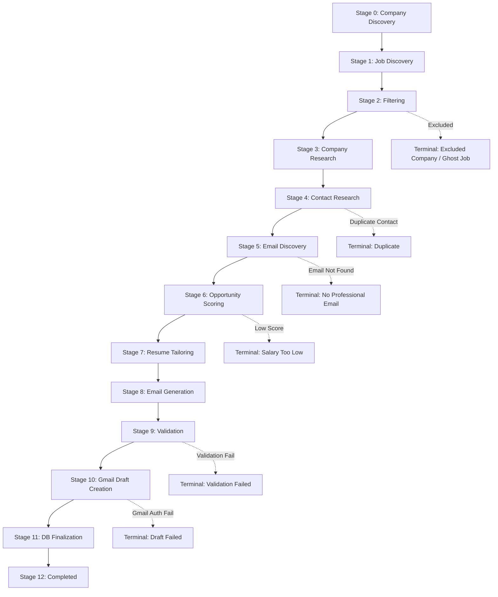

# Recruiting Platform Architecture & Design

This document details the production-grade architecture of the cold-email recruiting platform. It outlines the codebase layout, state machine transitions, SQLite database schemas, and integration points.

## System Architecture Overview

The system is designed with modularity, extensibility, and stateful resiliency as core tenets. It models the recruiting pipeline as a sequence of discrete, resumable stages.



## Directory Structure

The project conforms to a clean, package-centric Python structure:

```text
├── config.yaml          # System-wide configuration
├── Makefile             # Developers task runner
├── pyproject.toml       # Package dependencies & tool configs (Ruff/Mypy/Hatch)
├── README.md            # Quickstart documentation
├── resumes/
│   ├── resume_vineet_kushwaha.typ   # Base Typst resume (Immutable)
│   └── generated/                   # Tailored Typst/PDF resumes
├── data/
│   └── platform.db      # SQLite database file
├── logs/
│   └── platform.log     # Structured pipeline execution logs
├── src/
│   ├── __init__.py
│   ├── cli.py           # Typer command-line interface
│   ├── config.py        # Pydantic configuration parser
│   ├── web_server.py    # Web server serving REST APIs & status dashboard
│   ├── static/          # Web widget & dashboard frontend (index.html)
│   ├── db/
│   │   ├── __init__.py
│   │   ├── models.py    # SQLAlchemy database models
│   │   └── session.py   # Database session factory & foreign key pragma
│   ├── pipeline/
│   │   ├── __init__.py
│   │   ├── runner.py    # Run state machine orchestrator
│   │   └── stages.py    # Stage-by-stage implementation logic
│   ├── providers/
│   │   ├── __init__.py
│   │   ├── browser.py   # HTTP / Playwright scrapper
│   │   ├── gmail.py     # OAuth Gmail compose draft builder
│   │   └── llm/         # LLM vendor implementations (Local AGY, OpenAI, Claude, Gemini)
│   └── utils/
│       ├── __init__.py
│       ├── caching.py   # SQLite-backed key-value caching with TTL
│       └── logging.py   # Structured logging utility (Console Rich + File JSON)
└── tests/
    ├── __init__.py
    ├── test_caching.py  # Cache unit tests
    ├── test_config.py   # Config parsing tests
    ├── test_pipeline.py # Mock pipeline integration tests
    └── test_scoring.py  # Opportunity scoring tests
```

## Database Schema (SQLite)

The database schema utilizes normalized tables to maintain data integrity and track state:

| Table Name | Primary Key | Key Columns / Foreign Keys | Description |
| :--- | :--- | :--- | :--- |
| **`runs`** | `id` (String) | `started_at`, `status` | Tracks every CLI/TUI pipeline session. |
| **`companies`** | `id` (Integer) | `name` (unique), `domain`, `research_data` (JSON) | Caches researched information per company. |
| **`jobs`** | `id` (Integer) | `company_id` (FK), `title`, `url`, `salary`, `experience_years_required` | Stores open jobs matching initial preferences. |
| **`contacts`** | `id` (Integer) | `company_id` (FK), `name`, `role`, `email` | Tracks individual contacts; enforces single outreach per contact/company. |
| **`applications`** | `id` (Integer) | `run_id` (FK), `job_id` (FK), `contact_id` (FK), `current_stage`, `state` | Core state tracker mapping a job to progress stages and scoring weights. |
| **`emails`** | `id` (Integer) | `application_id` (FK), `subject`, `body` (HTML), `gmail_draft_id` | Stores generated HTML cold emails and Gmail draft links. |
| **`resume_versions`**| `id` (Integer) | `application_id` (FK), `path`, `keywords_added`, `reasoning` | References custom generated resume versions. |
| **`history`** | `id` (Integer) | `application_id` (FK), `stage`, `state`, `run_id` | Maintains historical state transition logs for every application. |
| **`cache_entries`** | `key` (String) | `value` (JSON), `expires_at` | General key-value request, search, and LLM cache. |

## Resumability & Error Recovery

If a pipeline run crashes due to API limits, network timeouts, or OAuth token expirations, the state is persisted in `applications` and `history`.
- Calling `make resume` queries the database for active applications (`state` not in terminal list) and executes them starting precisely from their recorded `current_stage`.
- Calling `make retry` identifies applications currently flagged with recoverable failures (`Research Failed`, `Draft Failed`, `Validation Failed`), resets their stage counter back to the preceding operational stage, and resumes processing.
- The `NO DUPLICATES` check automatically flags redundant target contacts or already-emailed companies as `Duplicate` and bypasses Stage 5-10.